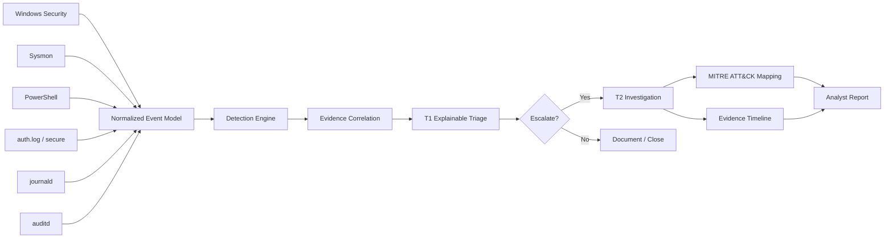

# SOCMind Architecture

SOCMind separates collection/parsing from detection and analyst reasoning so the same Tier 1/Tier 2 workflow can operate on Windows and Linux telemetry.

## Design principles

1. **Normalized telemetry, source-aware evidence** — events share a common schema but retain their raw/source-specific fields.
2. **Explainability over opaque scoring** — every finding includes the evidence and reasons that produced the score.
3. **Analyst-in-the-loop** — SOCMind recommends triage and escalation steps; it does not autonomously close incidents.
4. **Cross-platform first** — Windows and Linux are tested in CI.
5. **Safe portfolio datasets** — sample data uses documentation-only IP ranges and no live credentials or malware.
6. **Composable adapters** — future SIEM, EDR, auditd, Sigma, MISP, and threat-intel integrations can feed the same model.
7. **Missing evidence is an operational dependency, not a contradiction** — validation gaps can become permission-controlled Evidence Requirements with explicit lifecycle and audit history.
8. **Case state changes are auditable facts** — persistent case stores expose structured transition history derived from the append-only case audit trail.
9. **Timeline is a read model over durable facts** — the unified case timeline normalizes alerts, evidence, detections and audited analyst actions without replacing their source records.
10. **Identity is verified before RBAC** — local token, signed trusted-proxy and native OIDC authentication all resolve to the same SOCMind Principal/RBAC model.
11. **OIDC secrets stay out of source control** — client/session secrets are runtime environment values; provider discovery and JWKS are verified over HTTPS by default.
12. **OIDC browser sessions are bounded and same-origin** — Authorization Code + PKCE S256, state/nonce checks, signed HttpOnly cookies and safe return-path validation are enforced before workspace access.
